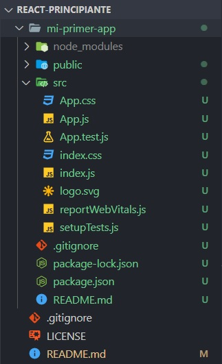
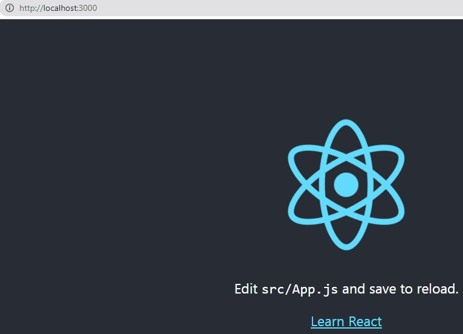
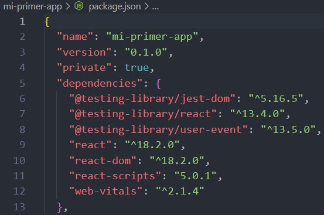
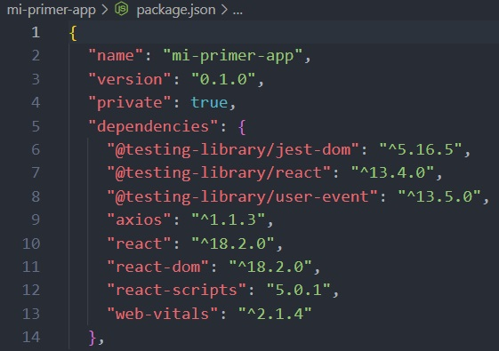
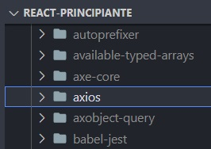

# Verifico versión de NODE (versión LTS)

Tener Node >= 14.0.0

```
>node --version
```

```
>node -v
```

```
>16.17.0
```

# Verifico versión de NPM (gestor de paquetes)

Tener npm >= 5.6

```
>npm --version
```

```
>npm --v
```

```
>8.5.4
```

# Creo mi-primer-app

npx es una herramienta de ejecución de paquetes que viene con npm 5.2+.

```
>npx create-react-app mi-primer-app
```

```
Inside that directory, you can run several commands:

  npm start
    Starts the development server.

  npm run build
    Bundles the app into static files for production.

  npm test
    Starts the test runner.

  npm run eject
    Removes this tool and copies build dependencies, configuration files
    and scripts into the app directory. If you do this, you can’t go back!

We suggest that you begin by typing:

  cd mi-primer-app
  npm start

Happy hacking!
```

# Me ubico en la carpeta creada del proyecto

```
>cd mi-primer-app
```

# Inicio el servidor de desarrollo

```
>npm start
```

```
> mi-primer-app@0.1.0 start
> react-scripts start

Compiled successfully!

You can now view mi-primer-app in the browser.

  Local:            http://localhost:3000
  On Your Network:  http://192.168.0.111:3000

Note that the development build is not optimized.
To create a production build, use npm run build.

webpack compiled successfully
```

Queda a la escucha de cambios

# Para bajar el servidor

`ctrl + c`

# Estructura creada



# Página principal



# Archivo package.json

Es un archivo de configuracón de mi proyecto.  
Las dependencias son los módulos que necesita mi proyecto.
Estan los propios, que los hago yo, los nativos de NODE y en dependencias los módulos de terceros.  
npx además de instalar todo me trajo los módulos que necesito para mi proyecto.  
Cuando ejecuto `npm i` se arma una carpeta `node_modules` donde se agregan todas las carpetas y archivos necesarios para ejecutar los módulos que estoy instalando para ejecutar el proyecto.


# Si quiero instalar un módulo, por ejemplo: el modulo de axios

```
>npm install axios
```

Lo registra en dependencias, que son los módulos de terceros que voy a utilizar en mi proyecto y lo instala dentro de la carpeta `node_modules`.  

  
Por buena práctica se omite subir la carpeta `node_modules` al repositorio, ya que es muy grande.  
Cuando bajo un proyecto del repositorio no tengo los modulos instalados que necesita el proyecto.  
Entonces tengo que ejecutar:

```
>npm i
```

Va a las dependencias y descarga los archivos configurados en la carpeta `node_modules` para que el proyecto se pueda ejecutar.

# JSX

Sintaxis JSX, una mezcla ente `javascript` y `html`.

# Carpeta public

Tenemos el archivo `index.html`.  
Tengo solo un div.  
Ese div lo vamos a usar para añadirle algunas `cosas` adentro.  
Tomo el div en otro lugar y le pinto cosas dentro.

# Carpeta src

Vamos al `index.js`.  
`import React from 'react';` para utilizar funcionalidades de `react`, es un modulo de terceros que esta en la carpeta `node_modules`. Lo se porque esta en las dependencias.  
Todas las funcionalidades que trae `react` las estoy guardando en una variable `React`.  
Dentro del `root.render` estoy pintando un componente que lo estoy importando (`<App />`)

```javascript
import React from "react";
import ReactDOM from "react-dom/client";
import "./index.css";
import App from "./App";
import reportWebVitals from "./reportWebVitals";

const root = ReactDOM.createRoot(document.getElementById("root"));
root.render(
  <React.StrictMode>
    <App />
  </React.StrictMode>
);
```

Cuando se compile todo esto se convierte en html, css y javascript

# Componente App.js

Es un componente que estoy exportando.  
Puedo crear un solo componente y luego multiplicar.  
Y lo puedo personalizar.  
Todos son componentes que luego se reutilizan.  
Esto es la sintaxis JSX en elcomponente App.js

```jsx
<div className="App">
  <header className="App-header">
    
    <p>
      Edit <code>src/App.js</code> and save to reload.
    </p>
    <a
      className="App-link"
      href="https://reactjs.org"
      target="_blank"
      rel="noopener noreferrer"
    >
      Learn React
    </a>
  </header>
</div>
```
JSX me permite trabajar `html` e insertar `javascript`.  
En este caso a las clases las llamamos `className`.  
En JSX si llamo a una variable la tengo que poner entre llaves `{logo}`.  
El componente empieza con la primera letra en mayuscula.  
51 min