# Verifico versión de NODE (versión LTS)

Tener Node >= 14.0.0

```
>node --version
```

```
>node -v
```

```
>16.17.0
```

# Verifico versión de NPM (gestor de paquetes)

Tener npm >= 5.6

```
>npm --version
```

```
>npm --v
```

```
>8.5.4
```

# Creo mi-primer-app

npx es una herramienta de ejecución de paquetes que viene con npm 5.2+.

```
>npx create-react-app mi-primer-app
```

```
Inside that directory, you can run several commands:

  npm start
    Starts the development server.

  npm run build
    Bundles the app into static files for production.

  npm test
    Starts the test runner.

  npm run eject
    Removes this tool and copies build dependencies, configuration files
    and scripts into the app directory. If you do this, you can’t go back!

We suggest that you begin by typing:

  cd mi-primer-app
  npm start

Happy hacking!
```

# Me ubico en la carpeta creada del proyecto

```
>cd mi-primer-app
```

# Inicio el servidor de desarrollo

```
>npm start
```

```
> mi-primer-app@0.1.0 start
> react-scripts start

Compiled successfully!

You can now view mi-primer-app in the browser.

  Local:            http://localhost:3000
  On Your Network:  http://192.168.0.111:3000

Note that the development build is not optimized.
To create a production build, use npm run build.

webpack compiled successfully
```

Queda a la escucha de cambios

# Para bajar el servidor

`ctrl + c`

# Estructura creada


# Página principal


# Archivo package.json

Es un archivo de configuracón de mi proyecto.  
Las dependencias son los módulos que necesita mi proyecto.
Estan los propios, que los hago yo, los nativos de NODE y en dependencias los módulos de terceros.  
npx además de instalar todo me trajo los módulos que necesito para mi proyecto.  
Cuando ejecuto `npm i` se arma una carpeta `node_modules` donde se agregan todas las carpetas y archivos necesarios para ejecutar los módulos que estoy instalando para ejecutar el proyecto.


# Si quiero instalar un módulo, por ejemplo: el modulo de axios

```
>npm install axios
```

Lo registra en dependencias, que son los módulos de terceros que voy a utilizar en mi proyecto y lo instala dentro de la carpeta `node_modules`.  

  
Por buena práctica se omite subir la carpeta `node_modules` al repositorio, ya que es muy grande.  
Cuando bajo un proyecto del repositorio no tengo los modulos instalados que necesita el proyecto.  
Entonces tengo que ejecutar:

```
>npm i
```

Va a las dependencias y descarga los archivos configurados en la carpeta `node_modules` para que el proyecto se pueda ejecutar.

# JSX

Sintaxis JSX, una mezcla ente `javascript` y `html`.

# Carpeta public

Tenemos el archivo `index.html`.  
Tengo solo un div.  
Ese div lo vamos a usar para añadirle algunas `cosas` adentro.  
Tomo el div en otro lugar y le pinto cosas dentro.

# Carpeta src

Vamos al `index.js`.  
`import React from 'react';` para utilizar funcionalidades de `react`, es un modulo de terceros que esta en la carpeta `node_modules`. Lo se porque esta en las dependencias.  
Todas las funcionalidades que trae `react` las estoy guardando en una variable `React`.  
Dentro del `root.render` estoy pintando un componente que lo estoy importando (`<App />`)

```javascript
import React from "react";
import ReactDOM from "react-dom/client";
import "./index.css";
import App from "./App";
import reportWebVitals from "./reportWebVitals";

const root = ReactDOM.createRoot(document.getElementById("root"));
root.render(
  <React.StrictMode>
    <App />
  </React.StrictMode>
);
```

Cuando se compile todo esto se convierte en html, css y javascript

# Componente App.js declarado como function

Es un componente que estoy exportando.  
Puedo crear un solo componente y luego multiplicar.  
Y lo puedo personalizar.  
Todos son componentes que luego se reutilizan.  
Dentro de la etiqueta `<div>` esta la sintaxis JSX.

```jsx
function App() {
  return (
    <div className="App">
      <header className="App-header">
        
        <p>
          Edit <code>src/App.js</code> and save to reload.
        </p>
        <a
          className="App-link"
          href="https://reactjs.org"
          target="_blank"
          rel="noopener noreferrer"
        >
          Learn React
        </a>
      </header>
    </div>
  );
}

export default App;

```

JSX me permite trabajar `html` e insertar `javascript`.  
En este caso a las clases las llamamos `className`.  
En JSX si llamo a una variable la tengo que poner entre llaves `{logo}`.  
El componente empieza con la primera letra en mayuscula.  
El componente tiene la estructura de una function.  
Dentro del return tengo JSX.

```javascript
function App() {
  return (
    <div className="App">
      <header className="App-header">
        
        <p>
          Edit <code>src/App.js</code> and save to reload.
        </p>
        <a
          className="App-link"
          href="https://reactjs.org"
          target="_blank"
          rel="noopener noreferrer"
        >
          Learn React
        </a>
      </header>
    </div>
  );
}
```

# Creo un componente Boton.jsx declarado como function

Necesito exportar el componente para renderizarlo.  
Hay varias formas de exportar.

```javascript
function Boton() {
  return <button>1</button>;
}

export default Boton;
```

Para poder utilizarlo tengo que importarlo en el archivo `index.js`  
Si primero lo **exporto** y luego lo **importo**, VSC me ayuda con la importación.

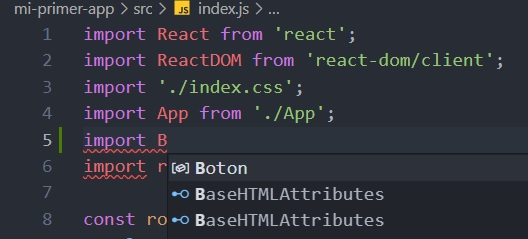

```jsx
import React from "react";
import ReactDOM from "react-dom/client";
import "./index.css";
import Boton from "./Boton";
import reportWebVitals from "./reportWebVitals";

const root = ReactDOM.createRoot(document.getElementById("root"));
root.render(
  <>
    <Boton />
  </>
);
```

Vamos a la página y tenemos el botón.

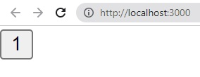

# Etiqueta Fragment

Es la etiqueta que me permite encerrar varios componentes sin necesidad de poner una etiqueta html que me influya a la hora de maquetar.

```jsx
const root = ReactDOM.createRoot(document.getElementById("root"));
root.render(
  <>
    <Boton />
    <Boton />
    <Boton />
    <Boton />
    <Boton />
    <Boton />
  </>
);
```

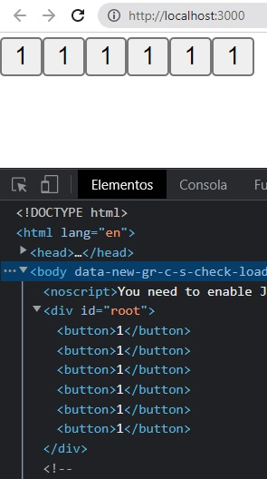

# Personalizo los componentes

Tengo que pasarle los parametros desde el componente.

```jsx
const root = ReactDOM.createRoot(document.getElementById("root"));
root.render(
  <>
    <Boton numero={1} />
    <Boton numero={2} />
    <Boton numero={3} />
    <Boton numero={4} />
    <Boton numero={5} />
  </>
);
```
# props  
Son las propiedades del componente que las estoy pasando.  
En `Boton.js`  
```jsx
function Boton(props) {
    return(
        <button>{props.numero}</button>
    )
}

export default Boton;
```
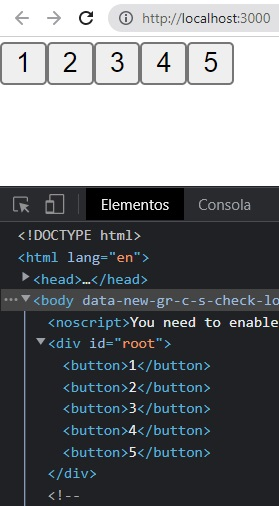
# Opción desestructurada
Puedo pasar directamente la propiedad **{numero}**.
```jsx
function Boton({numero}) {
    return(
        <button>{numero}</button>
    )
}

export default Boton;
```
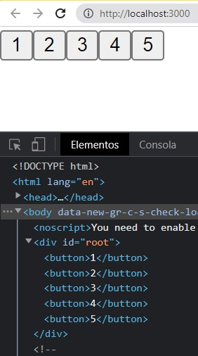  
# Limpiamos archivos con los que no vamos a trabajar  
setupTest.js  

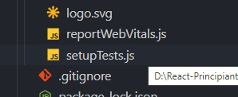  
reportWebVitals.js  

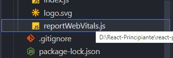  
logo.svg  

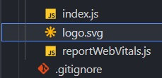  
App.test.js  

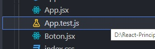  

# Puedo definir el componente como funcion flecha  
Trabaja de igual manera.  
```jsx
const Boton = ({numero}) => {
    return(
        <button>{numero}</button>
    )
}

export default Boton;
```
 # Ver props  
  * Que lleguen de un formulario.
  * Que lleguen de una base de datos.
  * Que lleguen de un json.
  * Que lleguen de una API.  

# Creamos componente Card.jsx
```jsx
function Card({nombre, fechaNacimiento, clubes, cromo}) {
    return(
        <div>
            <h1>{nombre}</h1>
            <p>{fechaNacimiento}</p>
            <p>{clubes}</p>
            <small>{cromo?'esta figurita es cromo':'no es un cromo'}</small>
        </div>
    )
}

export default Card;
```
`nombre` llega como **string**, si es string NO lleva {} queda con ''.  
`fecha de nacimiento` es un **number** entre {}.  
`clubes` es un **array**, entre {[]}  
`cromo` lo voy a pasar y va hacer un `true` o `false`.  
Si `cromo` es **true** entonces **esta figurita es cromo** si `cromo` es **false** entonces **no es un cromo**.  
En el index.js
```jsx
const root = ReactDOM.createRoot(document.getElementById("root"));
root.render(
  <>
    <Card nombre='Lionel Messi' fechaNacimiento={1987} clubes={['Barcelona','PSG']} cromo={true} />
    <Card nombre='Emiliano Martinez' fechaNacimiento={1992} clubes={['Arsenal','Aston Villa']} cromo={false} />
    <Boton numero={1} />
    <Boton numero={2} />
    <Boton numero={3} />
    <Boton numero={4} />
    <Boton numero={5} />
  </>
);
```
# Emoji para copiar y pegar
https://emojikeyboard.top/es/
```jsx
function Card({nombre, fechaNacimiento, clubes, cromo}) {
    return(
        <div>
            <h1>{nombre}</h1>
            <p>{fechaNacimiento}</p>
            <p>{clubes}</p>
            <small>{cromo?'Esta figurita es cromo 🌟​':'No es un cromo 😬'}</small>
        </div>
    )
}

export default Card;
```
  
```jsx
function Card({nombre, fechaNacimiento, clubes, cromo, late}) {
    return(
        <div>
            <h1>{nombre}</h1>
            <p>{fechaNacimiento}</p>
            <p>{clubes}</p>
            <small>{cromo?'Esta figurita es cromo 🌟 ​':'No es un cromo 😬 '}</small>
            <small>{late?'Late ✔️​':'Nola ✖️​'}</small>
        </div>
    )
}
```
```jsx
const root = ReactDOM.createRoot(document.getElementById("root"));
root.render(
  <>
    <Card nombre='Lionel Messi' fechaNacimiento={1987} clubes={['Barcelona','PSG']} cromo={true} late={false}/>
    <Card nombre='Emiliano Martinez' fechaNacimiento={1992} clubes={['Arsenal','Aston Villa']} cromo={false} late={true}/>
    <Boton numero={1} />
    <Boton numero={2} />
    <Boton numero={3} />
    <Boton numero={4} />
    <Boton numero={5} />
  </>
);
```
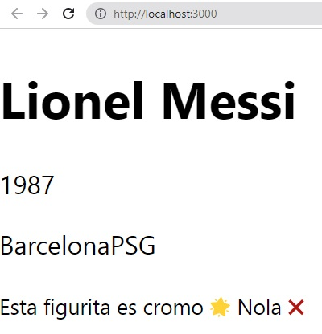  

# Hay forma de pasar un parámetro por defecto  
¿Que pasa si algun props falla y no hay ninguno por defecto?
```jsx
const Boton = ({numero='default'}) => {
    return(
        <button>{numero}</button>
    )
}

export default Boton;
```
```jsx
const root = ReactDOM.createRoot(document.getElementById("root"));
root.render(
  <>
    <Card nombre='Lionel Messi' fechaNacimiento={1987} clubes={['Barcelona','PSG']} cromo={true} late={false}/>
    <Card nombre='Emiliano Martinez' fechaNacimiento={1992} clubes={['Arsenal','Aston Villa']} cromo={false} late={true}/>
    <Boton numero={1} />
    <Boton numero={2} />
    <Boton numero={3} />
    <Boton numero={4} />
    <Boton />
  </>
);
```
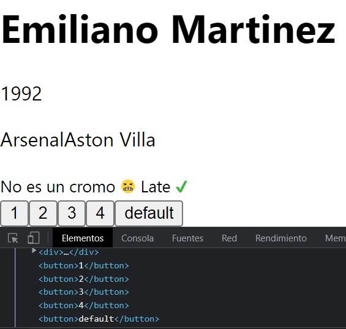  
# Estilos online en el componente  
Clave: Valor  
JSX omite (background-color) los guiones.
**backgroundColor: 'blue'**
```jsx
function Card({nombre, fechaNacimiento, clubes, cromo, late}) {
    return(
        <div>
            <h1 style={{backgroundColor: 'blue'}}>
                {nombre}
            </h1>
            <p>{fechaNacimiento}</p>
            <p>{clubes}</p>
            <small>{cromo?'Esta figurita es cromo 🌟 ​':'No es un cromo 😬 '}</small>
            <small>{late?'Late ✔️​':'Nola ✖️​'}</small>
        </div>
    )
}

export default Card;
```
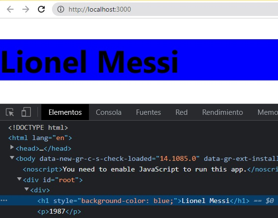